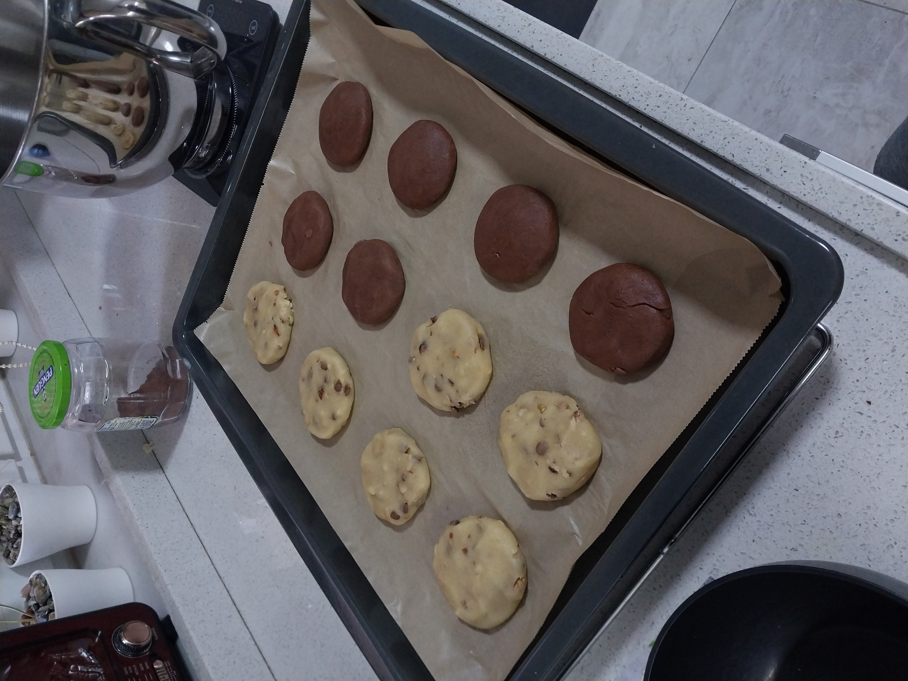
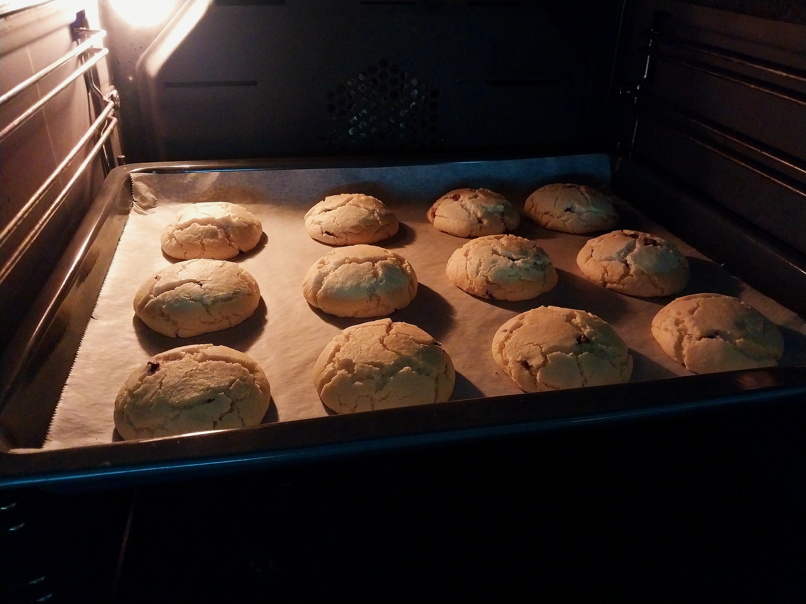
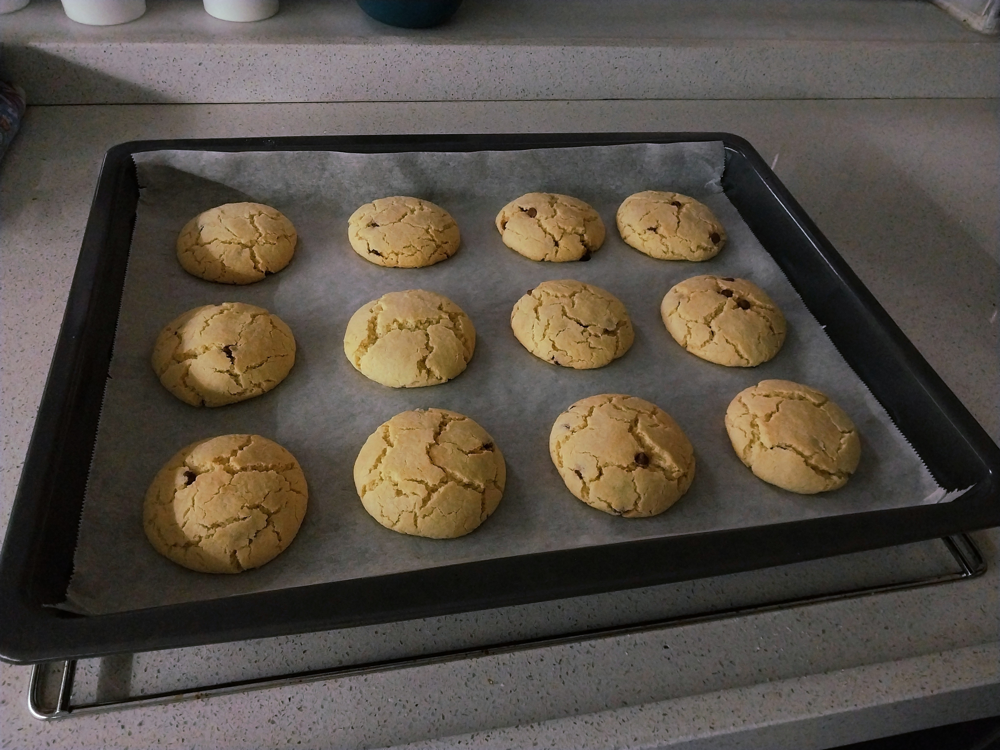
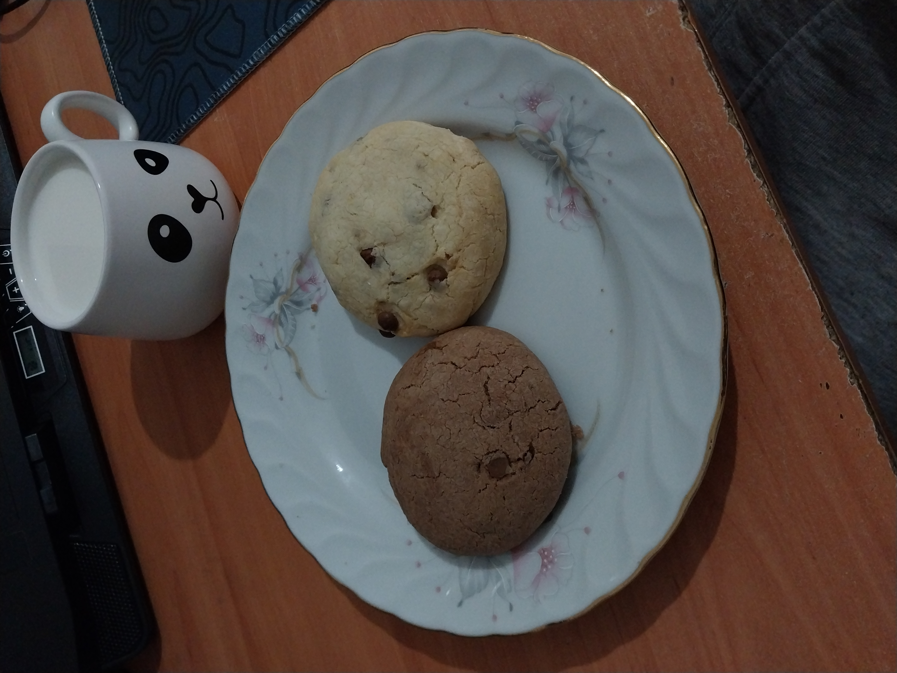

## Tarif Hakkında

&emsp;Bu tarif sayesinde; az malzemeyle, kısa sürede hazır olabilecek kıtır kıtır kurabiyeleriniz olacak! Ecnebilerin kurabiye dediklerinde birebir yaptıkları, çeşitli zincir kafelerde katur kutur yediğiniz o kurabiyeleri bu tarif sayesinde siz de yapabilirsiniz. 

  

## Tarif Özeti

1 - Fırını 180 dereceye ayarla ve ısınmaya bırak.

2 - Yumurta ve şekeri bir kapta karıştır.

3 - Sıvı yağ, kabartma tozu ve vanilyayı ekle iyice karıştır. 

4 - Ardından tüm nişastayı karışıma ekle ve iyice karıştır.

5 - Oluşan karışım kendini toparlayıp ele yapışmayan bir kıvam alana kadar unu ekle.

6 - İstenildiği taktirde içine dilediğin ek malzemeleri (çikolata parçaları, kakao, kuru yemiş vb.) bu aşamada ekle.

7 - Hamuru parçalara ayırarak fırın tepsisine diz.

8 - Kurabiyelerin üst kısımları kızardığında çıkar. Bir süre soğumaya bırak.

9 - Afiyet olsun!

  

## Tarif

- Öncesinde fırın 180 dereceye ayarla ve ısınması için bırak.

- Yumurta ve şeker geniş ve derin bir kaba al ve karıştır. Şeker komple yumurta içinde eriyince sıvı yağ, kabartma tozu ve vanilyayı ekle ve bir süre daha karıştır.

- Elde edilen karışıma tüm nişastayı eleyerek ekle. Nişasta görünmeyene dek karıştır.

- Unun bir bardaklık kısmını eleyerek komple ekle ve sonrasında yoğur. Devamında hamur kendini toplayana ve eline yapışmayana dek geri kalan undan biraz-biraz ekleyerek tekrar yoğur.

- Hamur istenen kıvama ulaştığında, ek malzemeleri (çikolata parçaları, kakao, kuru yemiş vb.) bu aşamda ekleyebilirsin.

- Eş parçalara ayır. Avuç içinde azıcık yuvarla. Eğer çok kıtır olmasını istiyorsan çok hafif bastırarak yassılaştır. Fazla yapma çünkü sıvı yağ kullanıldığından dolayı pişme anında kendiliğinden biraz da olsa yayılacaktır. Birbirlerinden iki üç parmak uzaklığında tepsiye diz.

*Kurabiyelerin fırın tepsisine dizilmiş hali.*

- Isınmış olan fırında yaklaşık 12 dakika pişmeye bırak. Ardından her bir dakikada bir olacak şekilde fırın kapağını açarak üstlerinin kızarıklığını ve çatlaklığını kontrol et.

*Kurabiyelerin fırında pişmiş, üstleri çatlamış görünümleri.*

- Kurabiyelerin üst kısımları az miktarda kızardığında ve üstlerinde çatlaklar oluştuğunda fırından çıkar ve soğumaya bırak. Kurabiyeler kendi sıcaklıklarıyla bir süre daha pişecektir.

*Fırından çıkmış, sıcak halleri.*

- Afiyet olsun!

*Afiyet olsun.*
