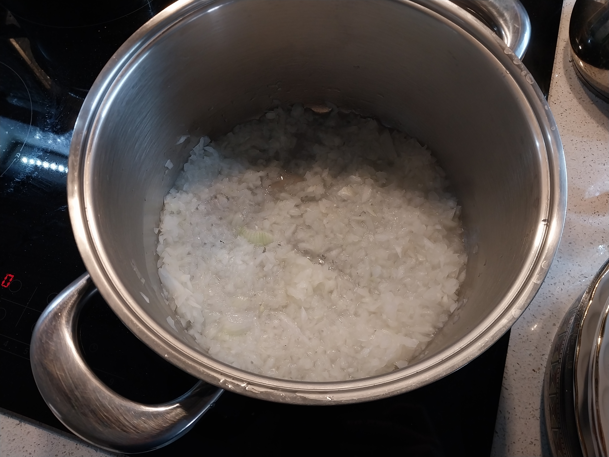
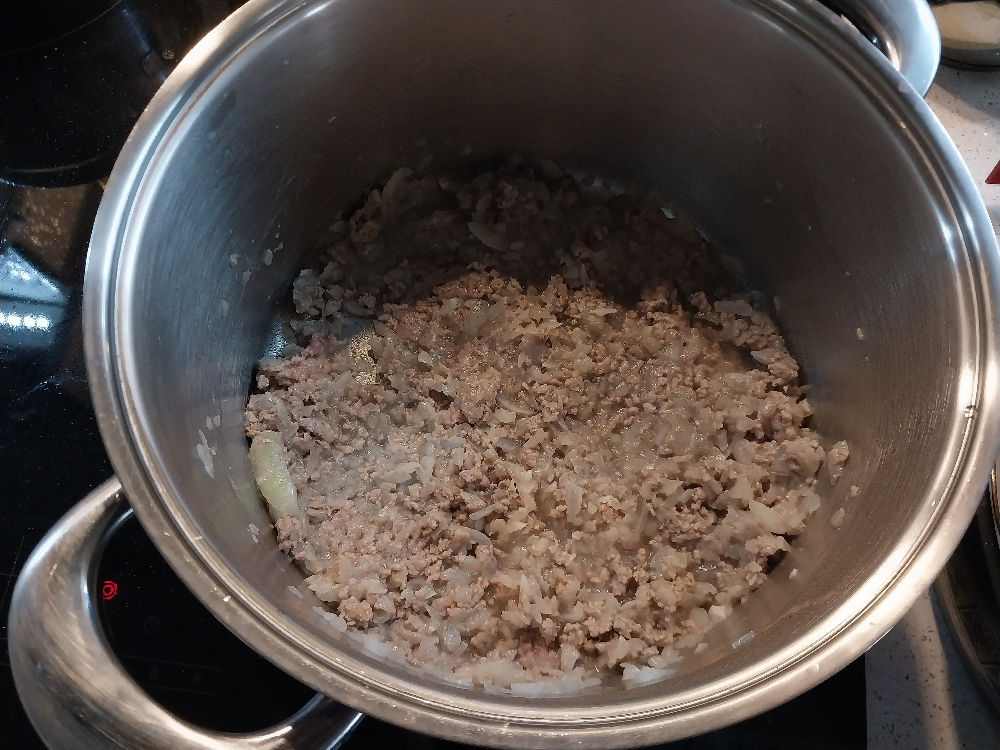
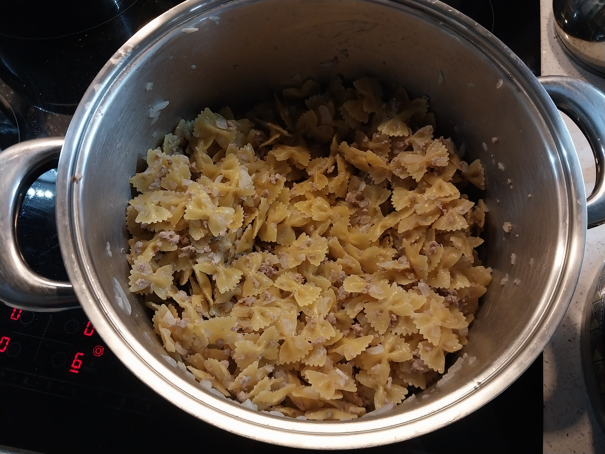
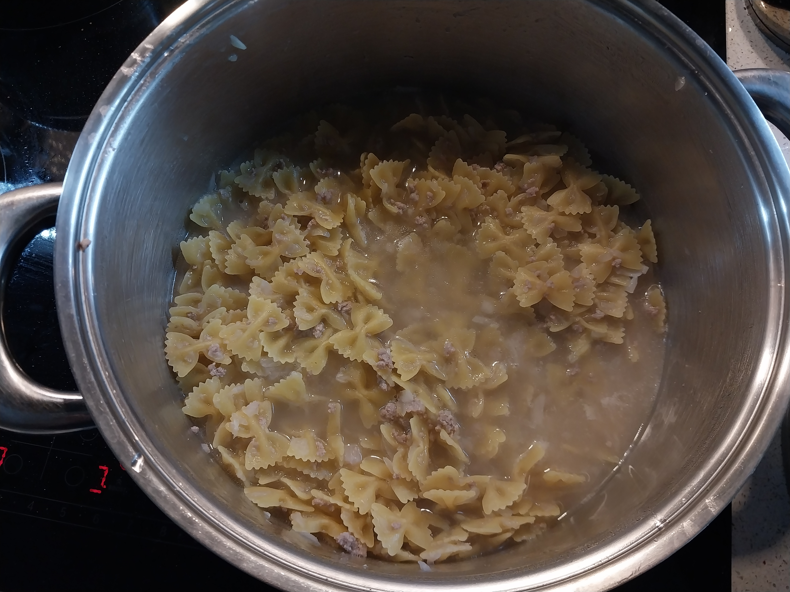
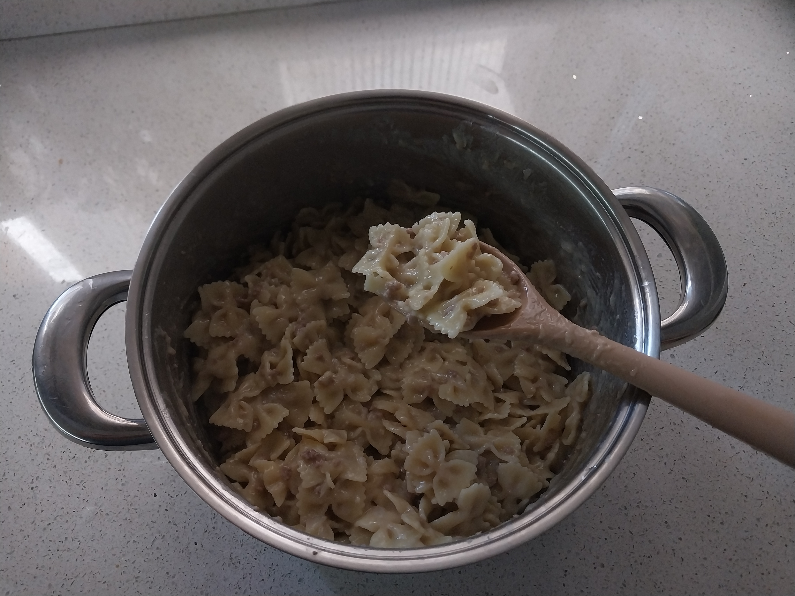
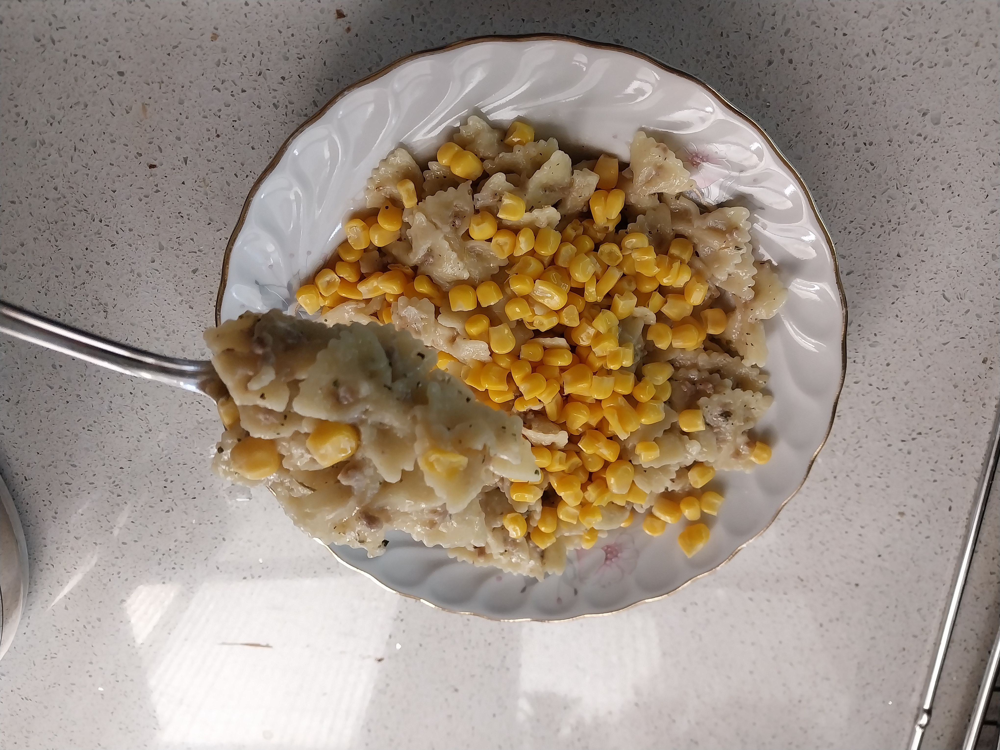

## Tarif Hakkında

&emsp;Haşlama makarnadan bıktığınızda, makarnanın süzgecini bile yıkamak istemediğinizde veya sadece farklılık aradığınızda yapmak için mükemmel bir tarif. Haşlama usulüne göre hem daha az yağ ile, hem de daha fazla aromayla hazırlanan bu makarna sayesinde karnınız uzun süreli tok kalacak!

  

## Tarif Özeti

1 - Kıymayı çözdür.

2 - Suyu kaynamaya bırak.

3 - Orta ısıda soğanları küp küp doğra ve hafif şeffaflaşana kadar tencerede döndür.

4 - Yağı ve kıymayı ekle, kıyma hafif grileşene kadar karıştır.

5 - Tencereye makarnayı ekle ve karıştır.

6 - Tuzu ve kaynar suyu ekle. Yüksek ısıda ara ara karıştır.

7 - Suyu bitince altını kapat.

8 - Biraz soğuyunca isteğe göre kekik ve nane ekleyebilirsin.

9 - Soğurken ara ara karıştırarak yağışmasını önleyebilirsin.

10 - Afiyet olsun!

  

## Tarif

- Yapmaya başlamadan önce kıymanın buzdolabında çözdürülmesi gerekiyor. Bu aşama çok önemli. Aksi durumda suyunu salar ve pişirildiğinde kuru kalır.

- Tencerenin altını orta derecede aç. Soğanları küp küp doğra ve ısınmış tencereye ekle ve ara sıra karıştır.

*Soğanların pişmiş hali.*

- Soğanlar piştikçe şeffaflaşacaktır. Hafif şeffaflaştıklarında kıymayı ekle. Kıyma çok hafif grileşene kadar karıştırarak pişir.

*Kıymanın pişmiş hali.*

- Tarif kavurma makarna tarifi olduğundan ve sıfır bulaşıkla iş yapmak için bu aşamada makarnayı da tencereye ekle. Dikkat et hala karışıma herhangi bir su eklemedik. Tuzu bu aşamada ekle ve karıştırarak pişir.

*Harç ile makarnanın buluşması.*

- Karışımı bir süre pişirdikten sonra suyu ekle. İkinci önemli kısım burası. Makarnalar hizasında su koymak yeterli olacaktır. Bu aşamada artık karıştırmayı nadiren yapman yeterli olacaktır. Eğer su çok azalmış olmasına rağmen hala makarnalar yumuşamamış durumdaysa; daha fazla su ekle ve/veya ısıyı düşür. Eğer tam tersi çok su olmasıyla birlikte makarnalar yumuşamaya başladıysa; ısıyı arttırıp çok sık karıştırarak sudan kurtulabilirsin. Dikkat edersen az su kalması durumundaki çözüm çok daha basit.

*Yeterince su eklenmiş hali.*

- Makarnaların suyu bitmiş ve yumuşamış olduğunda altını kapat ve soğuması için kenara al. Bir süre sonra ilk sıcaklığı azaldıktan sonra tercihe göre içine tereyağı, kekik ve nane ekleyebilirsin.

*Nihai makarna.*

- İsteğe göre servis sırasında üzerine yoğurt, mısır, turşu eklenebilir... Afiyet olsun!

*Afiyet olsun.*
